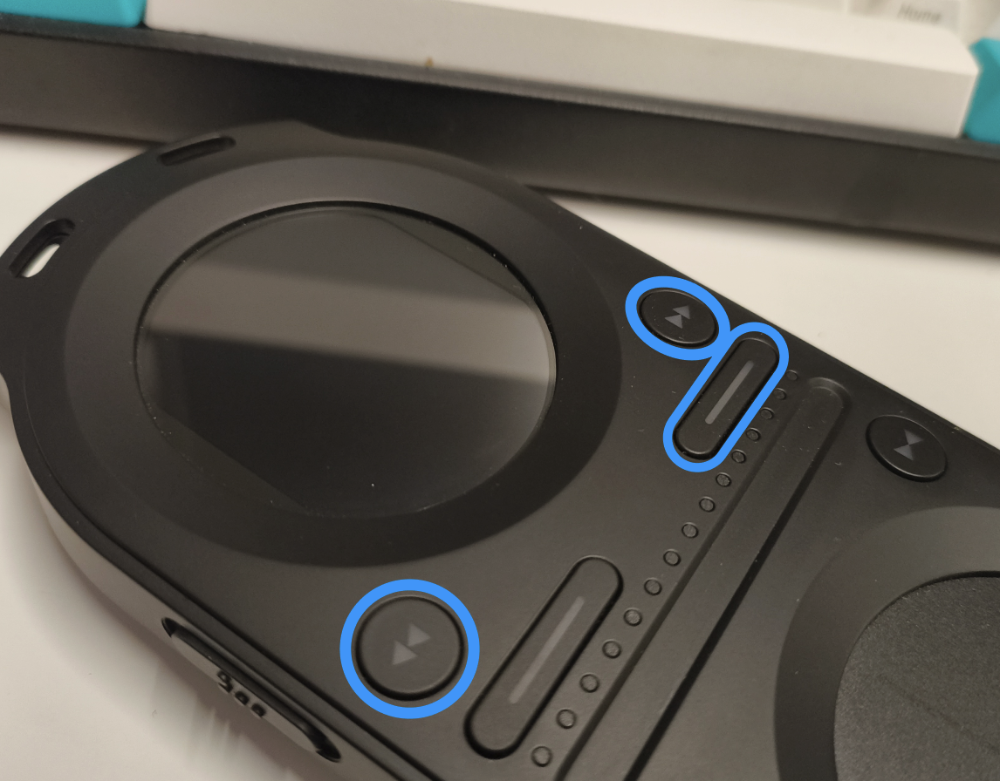
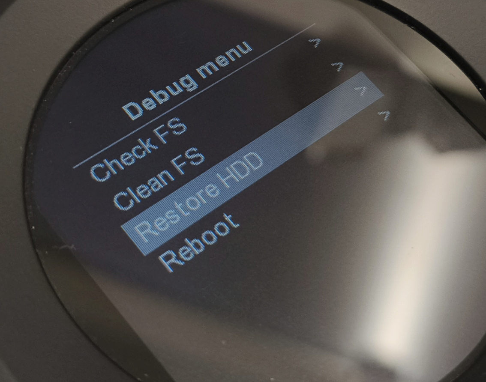

# Pacemaker

A kotlin script to manage and add MP3s to a [Tonium Pacemaker](https://en.wikipedia.org/wiki/The_Pacemaker) on macOS. If you find an old Pacemaker and use Apple computers you were previously a bit stuck and forced to somehow run Windows to use the old 1st party Pacemaker Edit. With this script you can unbrick a broken device, setup a new blank solid state disk (if you're confident enough to carry out the mod), and of course transfer MP3s.

## Setup

Use [sdkman.io](https://sdkman.io/) to install [Kotlin](https://sdkman.io/sdks#kotlin) on your macOS computer:

```
curl -s "https://get.sdkman.io/" | bash
source "~/.sdkman/bin/.sdkman/bin/sdkman-init.sh"
sdk version  
sdk install kotlin
```

Clone this repository, then either run via kotlin with `kotlin pacemaker.main.kts` or `chmod +X pacemaker.main.kts` to make the script executable and run from the directory with `./pacemaker.main.kts`

## Commands

* `./pacemaker.main.kts` - shows some brief usage instructions
* `./pacemaker.main.kts install` - initialises a Pacemaker with the last official firmware from Tonium
* `./pacemaker.main.kts install someFirmware.pfw` - initialises firmware supplied as argument
* `./pacemaker.main.kts version` - fetches and parses the installed firmware version
* `./pacemaker.main.kts audio.mp3` - will extract information from an MP3 file, write the data to the Pacemaker database and copy the file to your device
* `./pacemaker.main.kts audio.mp3 -bpm` - as above, but will calculate the track BPM using [Aubio](https://aubio.org/) if installed (bypassed if BPM already exists as a tag)
* `./pacemake.main.kts folderpath` - iterates all files in a directory and processes any MP3s as above
* `./pacemake.main.kts folderpath -bpm` - as above but calculates BPM using Aubio
* `./pacemaker.main.kts restore` - if something goes wrong you can undo the database changes
* `./pacemaker.main.kts copydb` - copy the database from the Pacemaker to your local directory. Useful for development only
* `./pacemaker.main.kts pushdb` - copy music.db from the local directory to the Pacemaker
* `./pacemaker.main.kts unmount` - unmount the Pacemaker from macOS so it can be used
* `./pacemaker.main.kts tree` - if `tree` is installed will list the Pacemaker directory files

## Current/todo

When installing firmware if downgrading the firmware versions in system.xml need setting to a lower value to allow the upgrade:

```
SWVERSION="0"
FWVERSION="0"
```

## Troubleshooting

If you ever brick your Pacemaker turn it off then hold down the rewind, fast-forward, and channel 2 buttons, then press power keeping the 3 buttons held down. A debug menu will appear where you can wipe the hard disk and start again with `./pacemaker.main.kts install`

| Buttons | Menu |
| -------- | ------- |
|  |  |

## BPM Analysis

I recommend using either an existing DJ tool if you use one already to write the `TBPM` field to your MP3s ([VirtuaDJ](https://www.virtualdj.com/), [Serato](https://serato.com/dj), [RecordBox](https://rekordbox.com)), or better yet try [BPM Analyzer](https://viktorgordienko.com/bpm-analyzer/) by Viktor Gordienko ([App Store link](https://apps.apple.com/us/app/bpm-analyzer/id6667105007)) which does the same but is a tiny lightweight utility. This project can also use Aubio if installed (see below) but I found more accurate analysis using Viktor's implementation (in fact Aubio seems consistently slow by 2 to 3 BPM).

## Aubio

**Note. I'm not confident Aubio is accurate, there's a rounding error somewhere. Tracks that other software report with sensible values (130bmp, 133bpm) are always reported by Aubio as some non-sensical value, eg: 131.33345 bpm. If I can find a more reliable command-line alternative I'll switch to that soon but I strongly recommend using BPM Analyzer as above instead.**

[Aubio](https://aubio.org/) is used to calculate the BPM of tracks. It's easy to install using [brew](https://brew.sh/): `brew install aubio` (note. it uses a lot of dependencies and will take ~20 minutes to install depending on your internet connection speed). 

If brew fails with the message:

```
Error: gcc: the bottle needs the Apple Command Line Tools to be installed.
You can install them, if desired, with:
	xcode-select --install
```

enter `xcode-select --install` - it'll appear to do nothing but your macOS desktop will have a dialog where you can carry on installation (do the 3 finger swipe-up gesture on the magic track pad to see the dialog).

---

## Beat analysis

Alongside the .MP3s on the device the Pacemaker Edit software also adds a .str metadata file which contains the location/timestamp of each beat. Reverse engineering the format would enable this script to enable full beat locking functionality on the Pacemaker. See this old formum post for an outline of the format: [pacemakerdevice.org/forum/viewtopic.php?t=167](https://pacemakerdevice.org/forum/viewtopic.php?t=167)

[Example beat analysis .str file](./beatanalysis/7a5461c.str)